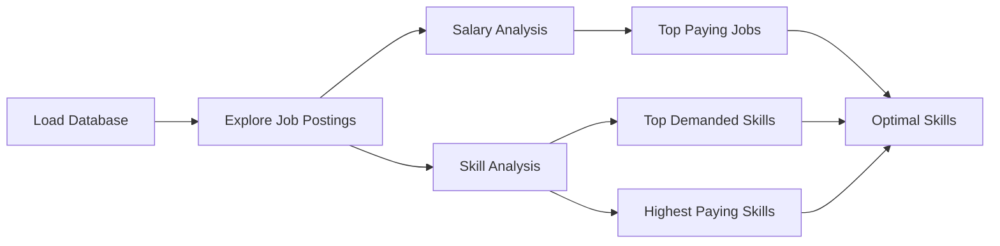
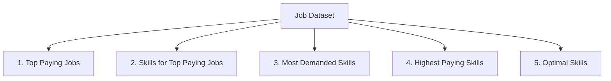
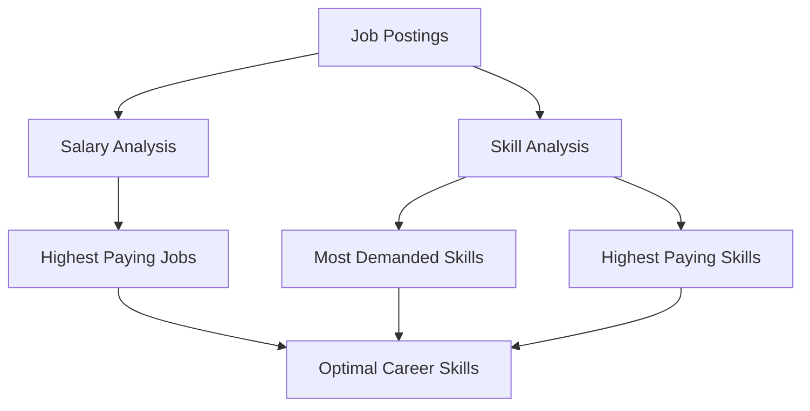

# SQL Job Market Analysis Project

A real-world SQL data analysis project that explores the data job market using PostgreSQL. The project answers key business questions related to salaries, in-demand skills, and optimal career paths through a series of SQL queries.

---

## 📖 Project Overview

This project analyzes a dataset containing information about data-related jobs, including:

- 💼 Job Titles
- 💰 Salaries
- 📍 Locations
- 🏢 Companies
- 🛠 Required Skills

Using SQL, the project extracts valuable insights to help identify:

- Highest-paying jobs
- Skills associated with high salaries
- Most in-demand technical skills
- Best skills to learn based on both demand and salary

---

## 📂 Project Structure

```text
project_sql/
│
├── 1_top_paying_jobs.sql
├── 2_top_paying_job_skills.sql
├── 3_top_demanded_skills.sql
├── 4_top_paying_skills.sql
└── 5_optimal_skills.sql
```

---

# 📊 Project Workflow



---

# 🗂 SQL Analysis Roadmap



---

# 🚀 How to Use

### Step 1

Import the database by following the instructions inside the **`sql_load`** folder.

---

### Step 2

Open the project in your preferred SQL editor.

Recommended:

- PostgreSQL
- pgAdmin
- DBeaver
- VS Code with PostgreSQL Extension

---

### Step 3

Run the SQL files **in any order**.

Each file is independent and answers a different business question.

---

# 📁 Project Files

## 1️⃣ `1_top_paying_jobs.sql`

### Objective

Identify the highest-paying data analyst jobs.

### Key Concepts

- WHERE
- ORDER BY
- LIMIT
- Salary Filtering

### Business Question

> Which companies offer the highest salaries for Data Analyst positions?

---

## 2️⃣ `2_top_paying_job_skills.sql`

### Objective

Find the skills required for the highest-paying jobs.

### Key Concepts

- INNER JOIN
- Multiple Table Joins
- ORDER BY

### Business Question

> Which technical skills are required for the highest-paying jobs?

---

## 3️⃣ `3_top_demanded_skills.sql`

### Objective

Identify the most frequently requested skills.

### Key Concepts

- GROUP BY
- COUNT()
- Aggregation
- ORDER BY

### Business Question

> Which skills appear most often in job postings?

---

## 4️⃣ `4_top_paying_skills.sql`

### Objective

Calculate the average salary associated with each skill.

### Key Concepts

- AVG()
- GROUP BY
- HAVING
- Aggregation

### Business Question

> Which skills command the highest average salary?

---

## 5️⃣ `5_optimal_skills.sql`

### Objective

Find skills that are both highly demanded and highly paid.

### Key Concepts

- CTEs
- Multiple Aggregations
- Joins
- Filtering

### Business Question

> Which skills provide the best balance between demand and salary?

---

# 📈 Analysis Flow



---

# 🛠 SQL Concepts Used

- SELECT
- WHERE
- ORDER BY
- LIMIT
- INNER JOIN
- LEFT JOIN
- GROUP BY
- HAVING
- COUNT()
- AVG()
- Common Table Expressions (CTEs)
- Aggregate Functions
- Aliases
- Filtering
- Sorting

---

# 🎯 Learning Outcomes

By completing this project, you will learn how to:

- Analyze real-world datasets using SQL
- Write efficient multi-table JOIN queries
- Aggregate and summarize large datasets
- Discover business insights from raw data
- Solve practical SQL interview questions
- Use CTEs to simplify complex queries

---

# 📋 Prerequisites

Before running the project, ensure you have:

- PostgreSQL installed
- Database imported using the **`sql_load`** folder
- Basic understanding of SQL

---

# 📚 Dataset

The project uses a job market dataset containing information about:

- Job postings
- Companies
- Salaries
- Required skills
- Job locations

---

# 📌 Key Insights

This project helps answer questions such as:

- 💰 Which Data Analyst jobs pay the most?
- 🏢 Which companies offer the highest salaries?
- 🛠 Which skills are most in demand?
- 📈 Which skills lead to higher salaries?
- 🎯 Which skills should you learn to maximize career opportunities?

---

# 🤝 Contributing

Contributions, suggestions, and improvements are welcome.

If you discover a more efficient SQL solution, feel free to submit a pull request.

---

# 📄 License

This project is intended for educational purposes and SQL practice.
